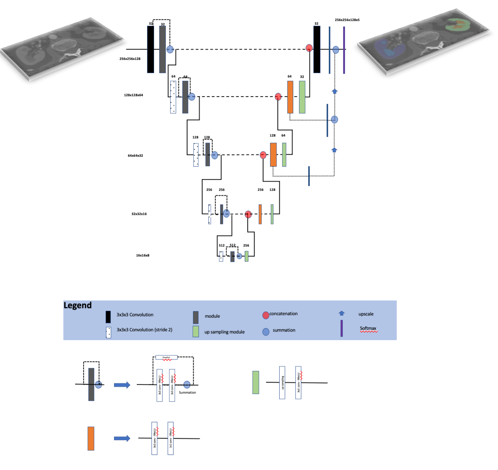

# README


Code utilized for the UNET model implemented in the following publication:

> Automated Segmentation of Kidney Cortex and Medulla in CT Images: a Multisite Evaluation Study 


Reference the above paper when parts of the repo are used. 




This repo contains the model as well as the inference code to apply the model in new datasets. 
An example case has been added. Due to limitation in sharing the training data an example test case (`case_00000_image_reo_crop.nii.gz`) 
originating from a publicly available dataset is used.

>Please note that the algorithm was developed utilizing a corticomedullary CT phase. We are not 
aware of publicly available datasets containing appropriate images so we opt to use an image from a contrast 
enhanced CT scan.  Additional the test case contains abnormalities. The data used to train the algorithm originate from 
healthy individuals. 

### Running the inference code 

Execute the following command:

```bash
python inference_tf.py --input_image data/case_00000_image_reo_crop.nii.gz --output_filename data/case_00000_image_reo_mask.nii.gz --model weights/weights.h5
```

> Note that depending on how  your environment is configured you might have to replace `python` with `python3`
### Dependencies 
Please utilize python 3.8.6 or above 

See the `requirements.txt` for dependencies. 

> pip install -r requirements.txt


### Issues

Report any issues utilizing the issue reporting mechanism. 

### Contirbutors

Timothy L Kline (Kline.Timothy@mayo.edu)

Panagiotis Korfiatis (Korfiatis.Panagiotis@mayo.edu)


Let us know if you are interested in collaboration relevant to this repository. 